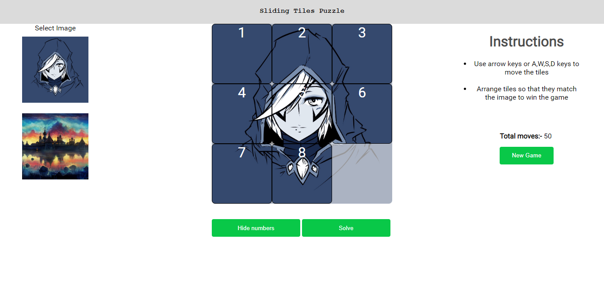

# Sliding tiles puzzle ( 8 Puzzle )

It's a sliding puzzle game ( 8 Puzzle ) with the implementation of A* algorithm to solve automatically.
It can be solved manually using A, W, D, S keys on the keyboard.

### scrambled puzzle

### solved puzzle

## Tile numbers
Every tile has a number according to its correct position to help to solve the game if it's difficult to know which tile goes where.
The number shown on the tiles can be toggled to show or hide with the given button.

## Implementation of A*
This algorithm uses a heuristic function to predict the correct solution of the problem.
For heuristic function, it uses Manhattan distance. When Manhattan distance becomes zero then, the present state of the puzzle is the required solution 

The grid class stores the present configuration of the puzzle i.e the positions of the tiles. When a tile is moved then its Manhattan distance is calculated and old value is updated. When this distance decreases it starts to reach toward the required solution.

This algorithm firstly calculates all the possible moves in the current state of the puzzle and for each move a separate new grid is formed with the configuration obtained on executing one of the available moves, then firstly it checks whether the same configuration has been generated before, if Yes then it is dropped, otherwise it is further traversed. Its Manhattan distance is calculated and this grid is then inserted in the priority queue. And the grid from which the current grid is formed is made its parent. This is performed on all available moves. Now a grid is popped from the queue and similar functions are performed.

This is done while we don't find a grid with zero manhattan distance i.e the required solution. Then the grid at the top of the priority queue is traversed recursively with help of its parent storing the moves with which it was created. This will give the required move sequence for achieving our solution.

This is then represented in html page in animated style.

## Ensuring Solvability of the Puzzle
It is not possible to solve an instance of 8 puzzle if number of inversions is odd in the input state.
So to ensure that it remains solvable after scrambling, Its scrambling is done with a solved puzzle and then multiple random moves are performed on it. So the number of inversions remain even at all moves.
